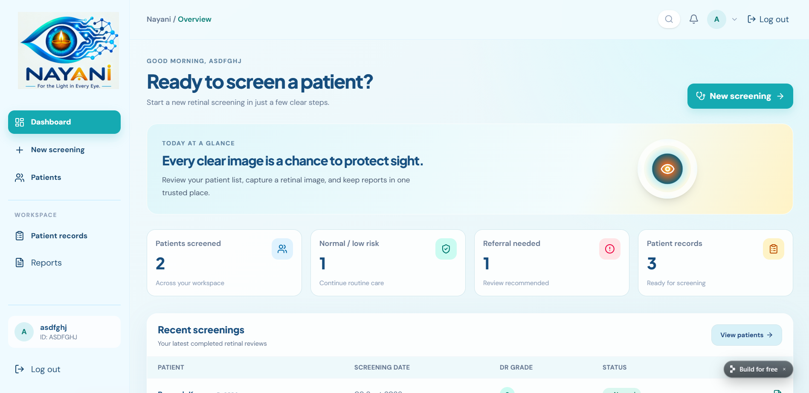
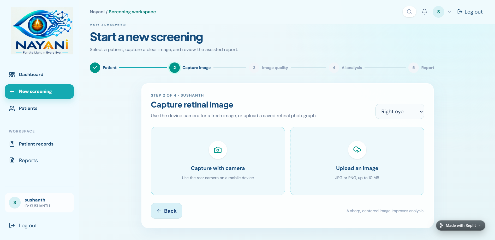
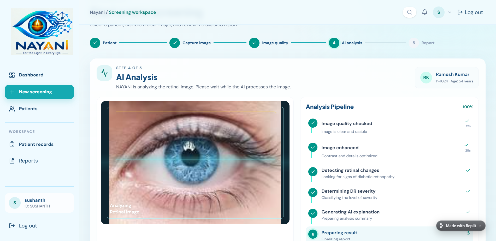
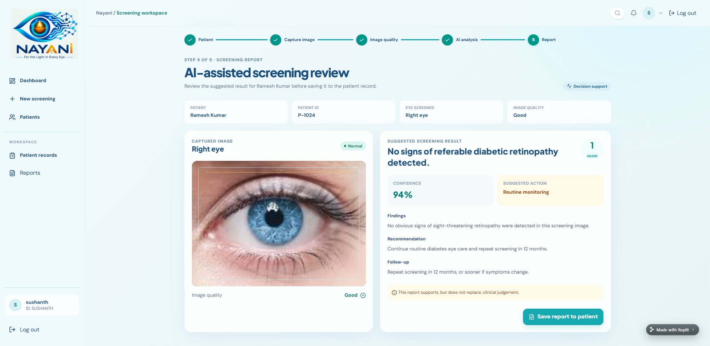

# 🩺 NAYANI

### AI-Assisted Screening for Diabetic Retinopathy

<p align="center">
  <strong>Explainable AI-assisted diabetic retinopathy screening designed with rural healthcare workflows in mind.</strong>
</p>

<p align="center">


</p>

## 🚀 Live Demo

👉 **[Launch NAYANI](https://nayani-retinal-screening--sushant1618981.replit.app/)**

---

## 🌟 Overview

**NAYANI** is an AI-assisted screening platform for diabetic retinopathy designed to demonstrate how retinal image analysis and explainable AI can support preliminary screening workflows.

The system takes a retinal image through a processing pipeline that performs image quality assessment, AI-based analysis, explainability visualization, severity estimation, and referral prioritization.

> **NAYANI is a prototype for educational and hackathon purposes and is not a clinically validated diagnostic system.**

---

## 🎯 Problem

Diabetic retinopathy can cause severe vision loss when it is not detected and managed early.

In resource-constrained and rural healthcare settings, access to specialized ophthalmic screening can be limited.

NAYANI explores how an AI-assisted workflow could help organize retinal-image screening and provide interpretable results that can support healthcare workers during preliminary screening.

---

## 💡 Our Solution

NAYANI provides an end-to-end screening workflow:

```text
Retinal Image
      │
      ▼
┌─────────────────┐
│ Image Upload    │
└────────┬────────┘
         ▼
┌─────────────────┐
│ Quality Check   │
└────────┬────────┘
         ▼
┌─────────────────┐
│ AI Analysis     │
└────────┬────────┘
         ▼
┌─────────────────┐
│ XAI Heatmap     │
└────────┬────────┘
         ▼
┌─────────────────┐
│ Severity Report │
└────────┬────────┘
         ▼
┌─────────────────┐
│ Referral        │
│ Priority        │
└─────────────────┘
```

---

## ✨ Key Features

* 📷 Retinal image upload
* 🔍 Image quality assessment
* 🤖 AI-assisted retinal image analysis
* 🧠 Explainable AI visualization
* 🌡️ Severity estimation
* 📊 Screening report generation
* 🚨 Referral-priority support
* ⚡ FastAPI backend
* 💻 React + Vite frontend
* 🖼️ OpenCV/Pillow image processing
* 🔐 Environment-based configuration
* 📱 Designed with accessibility and practical screening workflows in mind

---

## 🏗️ System Architecture

```text
                    ┌────────────────────┐
                    │      User /        │
                    │ Healthcare Worker  │
                    └─────────┬──────────┘
                              │
                              ▼
                    ┌────────────────────┐
                    │   React Frontend   │
                    │      + Vite        │
                    └─────────┬──────────┘
                              │
                         HTTP / API
                              │
                              ▼
                    ┌────────────────────┐
                    │   FastAPI Backend  │
                    └─────────┬──────────┘
                              │
                ┌─────────────┼─────────────┐
                ▼             ▼             ▼
          Image Quality   AI Analysis    Processing
             Check          Engine       OpenCV/Pillow
                │             │
                └──────┬──────┘
                       ▼
                ┌───────────────┐
                │ Explainability│
                │  / XAI Layer  │
                └───────┬───────┘
                        ▼
                ┌───────────────┐
                │ Severity &    │
                │ Referral      │
                │ Report        │
                └───────────────┘
```

---

## 🔄 Screening Pipeline

### 1. Image Upload

The user provides a retinal fundus image through the frontend.

### 2. Image Quality Check

The uploaded image is evaluated before further processing.

### 3. AI Analysis

The image is passed through the project's AI analysis pipeline.

### 4. Explainability

The system generates an explainability visualization to help indicate areas contributing to the model's output.

### 5. Severity Assessment

The system produces a prototype severity result.

### 6. Referral Priority

The result can be used to demonstrate a preliminary referral-priority workflow.

---

## 🛠️ Technology Stack

| Layer                | Technology   |
| -------------------- | ------------ |
| Frontend             | React        |
| Build Tool           | Vite         |
| Backend              | FastAPI      |
| Programming Language | Python       |
| Image Processing     | OpenCV       |
| Image Processing     | Pillow       |
| API Server           | Uvicorn      |
| Version Control      | Git + GitHub |

---

## 📁 Project Structure

```text
NAYANI/
│
├── backend/
│   ├── ...
│   └── requirements.txt
│
├── frontend/
│   ├── ...
│   └── package.json
│
├── docs/
│   ├── architecture.png
│   ├── pipeline.png
│   └── screenshots/
│
├── .env.example
├── .gitignore
├── CONTRIBUTING.md
├── LICENSE
├── SECURITY.md
├── CODE_OF_CONDUCT.md
└── README.md
```

---

## 🚀 Getting Started

### Prerequisites

Make sure you have installed:

* Python 3.x
* Node.js
* npm
* Git

---

## ⚙️ Backend Setup

Clone the repository:

```bash
git clone YOUR_GITHUB_REPOSITORY_URL
cd NAYANI
```

Navigate to the backend:

```bash
cd backend
```

Create a virtual environment:

```bash
python -m venv venv
```

Activate it on Windows:

```bash
venv\Scripts\activate
```

Install dependencies:

```bash
pip install -r requirements.txt
```

Start the backend:

```bash
uvicorn main:app --reload
```

Backend:

```text
http://127.0.0.1:8000
```

API documentation:

```text
http://127.0.0.1:8000/docs
```

---

## 💻 Frontend Setup

Open another terminal.

Navigate to the frontend:

```bash
cd frontend
```

Install dependencies:

```bash
npm install
```

Start the development server:

```bash
npm run dev
```

Frontend:

```text
http://localhost:5173
```

---

## 🔌 API

The backend is built using FastAPI.

Once the server is running, interactive API documentation can be accessed through:

```text
http://127.0.0.1:8000/docs
```

This provides an interactive interface for testing available API endpoints.

---

## 🧠 Explainable AI

One of the central goals of NAYANI is to make AI-assisted screening results more interpretable.

Instead of presenting only a prediction, the prototype includes an explainability visualization intended to demonstrate which image regions may have contributed to the model output.

> Explainability visualizations should be interpreted as model explanations rather than definitive medical evidence.

---

## 📸 Screenshots

### Home



### Image Upload



### AI Analysis



### Screening Report



---

## 📊 Prototype Status

| Component           | Status          |
| ------------------- | --------------- |
| Frontend            | ✅ Implemented   |
| Backend             | ✅ Implemented   |
| Image Processing    | ✅ Implemented   |
| AI Pipeline         | ✅ Prototype     |
| Explainability      | ✅ Prototype     |
| Screening Report    | ✅ Prototype     |
| Clinical Validation | ❌ Not completed |

---

## 🔮 Future Development

Potential future improvements include:

* Training and validation on clinically representative datasets
* External validation across different imaging devices
* Improved retinal image quality assessment
* More robust explainability methods
* Model performance monitoring
* Secure patient-data handling
* Healthcare-worker feedback workflows
* Offline/low-connectivity support
* Multilingual interfaces
* Deployment infrastructure
* Clinical evaluation and validation

---

## ⚠️ Medical Disclaimer

NAYANI is a **student/hackathon prototype**.

The current implementation is not intended to diagnose, treat, prevent, or replace professional medical assessment.

The included model should not be considered clinically validated. The current repository documentation describes the model as a deterministic prototype fallback, and a trained and validated model would be required before clinical use.

Healthcare professionals should make clinical decisions using appropriate medical examination, validated diagnostic systems, and established clinical guidelines.

---

## 👥 Team

### Team Phoenix

**NAYANI — SIH 2026**

Built as a Smart India Hackathon 2026 prototype.

---

## 🤝 Contributing

Contributions, suggestions, bug reports, and improvements are welcome.

Please read `CONTRIBUTING.md` before submitting a pull request.

---

## 📄 License

This project is distributed under the license included in this repository.

---

## ⭐ Support the Project

If you find this project interesting:

⭐ Star the repository
🍴 Fork the repository
🐛 Report issues
💡 Suggest improvements
🤝 Contribute

---

<p align="center">

### 🩺 NAYANI

**Technology for accessible, explainable screening**

</p>
